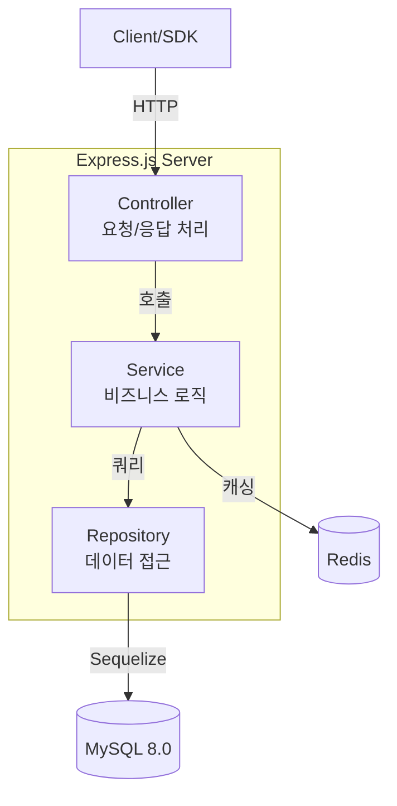
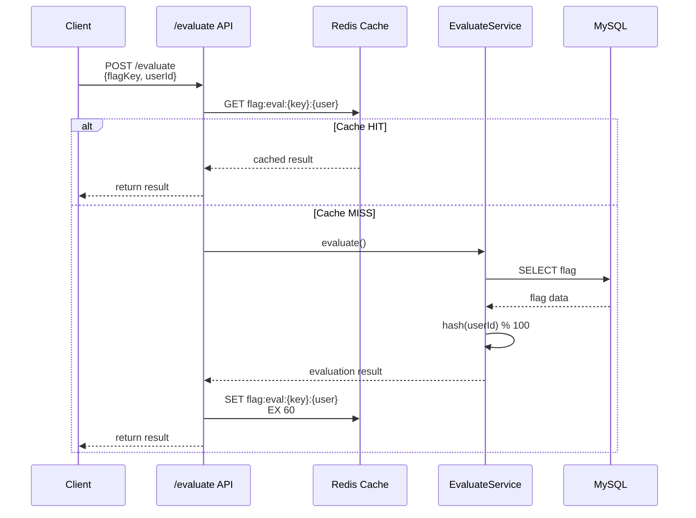

# 🚩 Feature Flag API

> 배포 없이 기능의 활성화/비활성화를 제어하는 Feature Flag 관리 시스템

## 프로젝트 소개

Feature Flag(기능 플래그)는 코드 배포 없이 런타임에 기능을 제어하는 기술입니다.

**왜 필요한가?**
- **A/B 테스트**: 10% 사용자에게만 새 기능 노출 → 데이터 기반 의사결정
- **카나리 배포**: 소수 사용자에게 먼저 배포 → 문제 발견 시 즉시 롤백
- **긴급 기능 차단**: 장애 발생 시 배포 없이 기능 OFF (kill switch)

**핵심 기능:**
- 플래그 CRUD + 활성/비활성 토글
- 3가지 전략: Boolean / Percentage Rollout / User Targeting
- Redis 캐싱으로 평가 성능 최적화 (< 10ms)
- 변경 이력 감사 로그 (Audit Log)
- SDK 스타일 평가 API (/evaluate)


---


## 기술 스택

| 영역 | 기술 | 선정 이유 |
|------|------|-----------|
| **런타임** | Node.js 18 + TypeScript | JS 생태계 활용 + 타입 안전성 |
| **프레임워크** | Express.js | 가볍고 유연한 웹 프레임워크 |
| **DB** | MySQL 8.0 | 관계형 데이터, 트랜잭션 지원 |
| **ORM** | Sequelize | TS 지원 + migration + paranoid |
| **캐시** | Redis | 평가 결과 캐싱, TTL 지원 |
| **검증** | Zod | 런타입 타입 검증 + 자동 에러 메시지 |
| **인증** | JWT + bcrypt | Stateless 인증, 패스워드 해싱 |
| **테스트** | Jest + Supertest | 단위/통합 테스트, HTTP mocking |
| **문서** | Swagger/OpenAPI | API 문서 자동화 |
| **배포** | Docker + Docker Compose | 일관된 환경, 원클릭 실행 |

### "왜 Sequelize인가?"

| 대안 | 비교 | Sequelize 선택 이유 |
|------|------|---------------------|
| TypeORM | 데코레이터 기반, 기능 풍부 | 학습곡선 낮음, 문서 풍부 |
| Prisma | 타입 생성 자동, 성능 우수 | 복잡한 쿼리 시 유연성 부족 |
| Raw SQL | 최고 성능 | 생산성 저하, 타입 안전성 없음 |

**Sequelize의 장점:**
- `paranoid: true`로 Soft Delete 자동 지원 → 감사 로그와 데이터 정합성
- `underscored: true`로 camelCase ↔ snake_case 자동 변환
- Transaction, Association, Migration 모두 내장

### "왜 Zod인가?"

```typescript
// Zod로 선언적 검증
const schema = z.object({
  key: z.string().regex(/^[a-z0-9-]+$/),  // kebab-case 강제
  percentage: z.number().min(0).max(100)
});

// 타입 추론까지
type FlagInput = z.infer<typeof schema>;  // TypeScript 타입 자동 생성
```

- Joi 대비 타입 추론 지원
- class-validator 대비 가벼움 (데코레이터 불필요)
- 자동 에러 메시지 한국어화 용이


## 아키텍처

### 3계층 구조 (3-Layer Architecture)



### 데이터 흐름: 플래그 평가



### 폴더 구조

```
feature-flag-api/
├── src/
│   ├── config/          # DB, Redis, 환경변수
│   ├── modules/
│   │   ├── auth/        # 인증 (JWT)
│   │   ├── flag/        # 플래그 CRUD
│   │   ├── evaluate/    # 플래그 평가 ★
│   │   └── audit/       # 감사 로그
│   ├── middlewares/     # 에러 핸들러, 인증
│   └── common/          # 유틸, 에러 클래스
├── tests/
│   ├── integration/     # API 계약 테스트
│   └── unit/            # 비즈니스 로직 테스트
└── docker-compose.yml
```


## 실행 방법

### 1. 클론 & 환경 설정 (1분)

```bash
git clone https://github.com/yourusername/feature-flag-api.git
cd feature-flag-api
cp .env.example .env
```

### 2. 인프라 실행 (Docker)

```bash
# MySQL + Redis 실행
docker-compose up -d

# 상태 확인
docker-compose ps
```

### 3. 앱 실행

**개발 모드 (권장):**
```bash
npm install
npm run dev
```

**또는 Docker 전체 실행:**
```bash
docker-compose -f docker-compose.prod.yml up -d
```

### 4. 검증

```bash
# 헬스체크
curl http://localhost:3000/healthz

# Swagger UI
open http://localhost:3000/api-docs
```

### 테스트 실행

```bash
# 전체 테스트
npm test

# 커버리지 리포트
npm run test:coverage
```

## API 문서

> 📚 **Swagger UI**: http://localhost:3000/api-docs

### 주요 엔드포인트

| Method | Endpoint | 설명 | 인증 |
|--------|----------|------|------|
| `POST` | `/api/v1/auth/register` | 회원가입 | - |
| `POST` | `/api/v1/auth/login` | 로그인 (JWT) | - |
| `POST` | `/api/v1/flags` | 플래그 생성 | JWT |
| `GET` | `/api/v1/flags` | 플래그 목록 | JWT |
| `PATCH` | `/api/v1/flags/:key` | 플래그 수정 | JWT |
| `POST` | `/api/v1/flags/:key/toggle` | 활성/비활성 토글 | JWT |
| `POST` | `/api/v1/evaluate` | 단일 플래그 평가 | API Key |
| `POST` | `/api/v1/evaluate/bulk` | 다중 플래그 평가 | API Key |
| `GET` | `/api/v1/flags/:key/audit` | 변경 이력 조회 | JWT |

### SDK 사용 예시

```javascript
// 클라이언트에서 플래그 평가
const response = await fetch('http://localhost:3000/api/v1/evaluate', {
  method: 'POST',
  headers: {
    'Content-Type': 'application/json',
    'x-api-key': 'your-api-key'
  },
  body: JSON.stringify({
    flagKey: 'new-checkout-flow',
    context: {
      userId: 'user_12345',
      attributes: { plan: 'premium' }
    }
  })
});

const result = await response.json();
// { flagKey: 'new-checkout-flow', enabled: true, reason: 'PERCENTAGE_MATCH' }
```

---


## 기술적 의사결정 (Architecture Decision Records)

### ADR-1: 퍼센트 롤아웃 — 해시 기반 분배

**문제**: 같은 사용자가 요청할 때마다 다른 결과를 받으면 UX 일관성이 깨짐

**대안 비교:**

| 방식 | 일관성 | 분포 | 구현 복잡도 |
|------|--------|------|-------------|
| `Math.random()` | ❌ 없음 | 균등 | 단순 |
| **해시 기반** | ✅ 있음 | 균등 | 중간 |
| DB에 버킷 저장 | ✅ 있음 | 균등 | 복잡 |

**선택**: 해시 기반 (SHA256)

```typescript
const hash = crypto
  .createHash('sha256')
  .update(`${flagKey}:${userId}`)
  .digest('hex');
const bucket = parseInt(hash.substring(0, 8), 16) % 100;
return bucket < percentage;
```

**장점:**
- 상태 비저장: 서버 메모리 불필요
- 캐시 가능: 같은 요청은 같은 결과
- 균등 분포: SHA256 특성상 공정

---

### ADR-2: 캐시 전략 — TTL vs 무효화

**문제**: 플래그 수정 시 캐시와 DB 불일치

**전략 비교:**

| 전략 | 일관성 | 복잡도 | 성능 |
|------|--------|--------|------|
| 짧은 TTL (60초) | 지연 일관성 | 단순 | 높음 |
| **TTL + 무효화** | 강한 일관성 | 중간 | 높음 |
| 무효화만 | 강한 일관성 | 복잡 | 낮음 |

**선택**: TTL(60초) + 플래그 수정 시 무효화

```typescript
// 평가 결과 캐싱 (TTL)
await redis.setex(cacheKey, 60, JSON.stringify(result));

// 플래그 수정 시 무효화
await invalidateCache(flagKey);
```

**트레이드오프:**
- 수정 후 최대 60초 지연 가능 (비즈니스적으로 수용)
- `KEYS` 명령은 O(N)이지만 MVP에서는 단순성 우선
- 프로덕션에서는 `SCAN` 또는 별도 무효화 큐 사용 권장

---

### ADR-3: Soft Delete (Paranoid)

**문제**: 플래그 삭제 시 감사 로그와의 데이터 정합성

**선택**: Sequelize `paranoid: true`

```typescript
// 실제 삭제 대신 deleted_at에 타임스탬프
DELETE FROM flags WHERE id = 1;
-- 대신
UPDATE flags SET deleted_at = NOW() WHERE id = 1;
```

**이유:**
1. 감사 로그의 `before` 스냅샷이 의미 있게 유지됨
2. "누가 언제 삭제했는지" 추적 가능
3. 실수로 삭제 시 복구 가능

**대안**: Hard Delete + 로그에 모든 필드 복사
- 복잡도 증가, 스토리지 낭비


## 개선 가능한 점 (Production Roadmap)

### 고우선순위 (즉시 적용 권장)

| 항목 | 현재 | 개선 | 효과 |
|------|------|------|------|
| **Redis KEYS → SCAN** | `KEYS flag:eval:*` | `SCAN 0 MATCH flag:eval:*` | O(N) → O(1), 프로덕션 안전 |
| **캐시 웜업** | 콜드 스타트 시 캐시 없음 | 앱 시작 시 핫 플래그 미리 캐싱 | 초기 레이턴시 감소 |
| **Rate Limiting** | 없음 | Redis 기반 | API 남용 방지 |

### 중우선순위 (단기 로드맵)

| 항목 | 설명 |
|------|------|
| **속성 기반 타깃팅** | `user.plan === 'premium' && user.country === 'KR'` 같은 규칙 평가 |
| **SDK 패키지화** | npm 패키지로 배포, 폴백/로컬 캐싱 내장 |
| **WebSocket 실시간** | 플래그 변경 시 클라이언트에 푸시 (폴링 제거) |

### 장기 로드맵

| 항목 | 설명 |
|------|------|
| **실시간 대시보드** | React + WebSocket으로 현재 활성 플래그/평가 통계 표시 |
| **멀티테넌시** | organization_id로 데이터 분리 (SaaS화) |
| **에지 캐싱** | CloudFlare Workers에서 평가 (지연 0ms) |
| **A/B 테스트 분석** | 평가 결과 → 데이터 웨어하우스 → 전환율 분석 |

---
